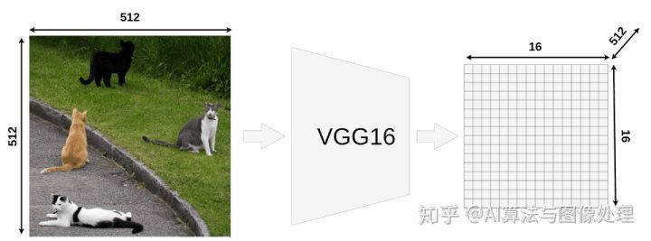
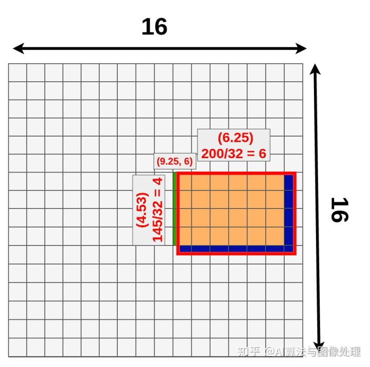
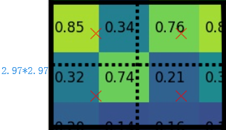

# RoI（Region of Interest）

## Fast R-CNN 的特征提取

  

模型取一个尺寸为 512x512x3 (宽度x高度x RGB) 的图像输入，VGG16将其映射为一个 16x16x512 的feature map。  

***如何从feature map 上获取 RoI ？***

  

每个RoI都有它的原始坐标和大小,无法将这些数字的大部分整除以 32(比例因子)。
例如：  
- width: 200/32 = 6.25

- height: 145/32 = ~4.53

- x: 296/32 = 9.25

- y: 192/32 = 6

只有最后一个数字(左上角的Y坐标)是有意义的。这是因为我们现在使用的是16x16 网格，我们关心的数字只有整数(更精确地说:自然数)。

## feature map 上坐标的量化

***量化是将输入从一大组值(如实数)约束为一组离散的值(如整数)的过程。***  
feature map 上的 原始 RoI:  

 

我们不能真正地在它上面应用池化层，因为一些“cells”被分割了。量化所做的就是每一个结果在放到矩阵上之前都进行约减。9.25变成9， 4.53变成4，等等。  

 

以上丢失了部分数据（深蓝色）同时获得了部分新的数据（绿色）：  

 

## RoI Pooling

RoiPooling的工作原理：  

 

- Conv layers使用的是VGG16，feat_stride=32(即表示，经过网络层后图片缩小为原图的1/32),原图800*800,最后一层特征图feature map大小:25*25

- 假定原图中有一region proposal，大小为665*665，这样，映射到特征图中的大小：665/32=20.78,即20.78*20.78，如果你看过Caffe的Roi Pooling的C++源码，在计算的时候会进行取整操作，于是，进行所谓的第一次量化，即映射的特征图大小为20*20

- 假定pooled_w=7,pooled_h=7,即pooling后固定成7*7大小的特征图，所以，将上面在 feature map上映射的20*20的 region  proposal划分成49个同等大小的小区域，每个小区域的大小20/7=2.86,即2.86*2.86，此时，进行第二次量化，故小区域大小变成2*2

- 每个2*2的小区域里，取出其中最大的像素值，作为这一个区域的‘代表’，这样，49个小区域就输出49个像素值，组成7*7大小的feature map

- 总结，所以，通过上面可以看出，经过两次量化，即将浮点数取整，原本在特征图上映射的20*20大小的region proposal，偏差成大小为7*7的，这样的像素偏差势必会对后层的回归定位产生影响

## ROI Align

RoiAlign的工作原理：  

 

- Conv layers使用的是VGG16，feat_stride=32(即表示，经过网络层后图片缩小为原图的1/32),原图800*800,最后一层特征图feature map大小:25*25
- 假定原图中有一region proposal，大小为665*665，这样，映射到特征图中的大小：665/32=20.78,即20.78*20.78，此时，没有像RoiPooling那样就行取整操作，保留浮点数
- 假定pooled_w=7,pooled_h=7,即pooling后固定成7*7大小的特征图，所以，将在 feature map上映射的20.78*20.78的region proposal 划分成49个同等大小的小区域，每个小区域的大小20.78/7=2.97,即2.97*2.97
- 假定采样点数为4，即表示，对于每个2.97*2.97的小区域，平分四份，每一份取其中心点位置，而中心点位置的像素，采用双线性插值法进行计算，这样，就会得到四个点的像素值，如下图：  
  
  
 
