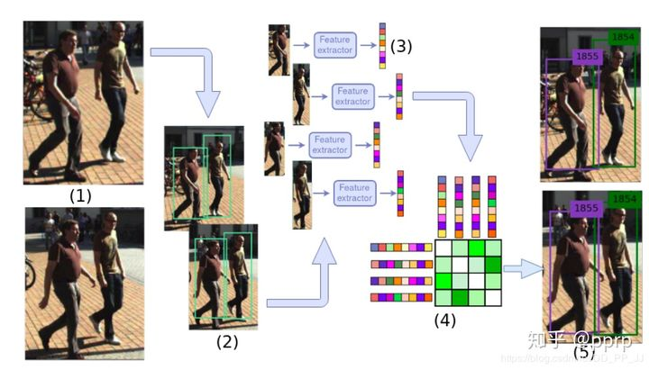
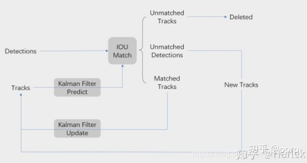
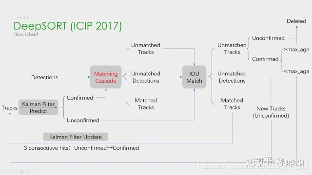
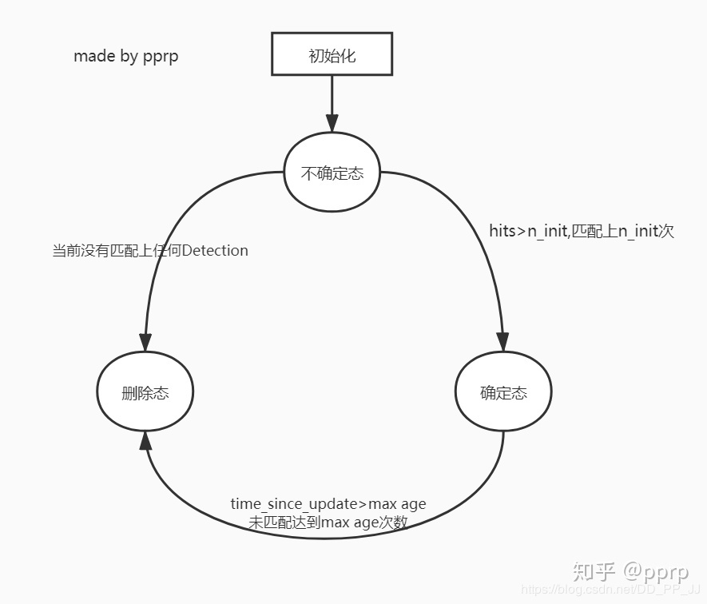

# Deep SORT 算法代码解析

***Detection Based Tracking***

## MOT 主要步骤

在《DEEP LEARNING IN VIDEO MULTI-OBJECT TRACKING: A SURVEY》这篇基于深度学习的多目标跟踪的综述中，描述了MOT问题中四个主要步骤： 

  

- 给定视频原始帧
- 运行目标检测器进行检测，获取目标检测框
- 将所有目标框中的目标抠出来，进行特征提取（包括表观特征和运动特征）并进行相似度计算，计算前后两帧目标间的匹配程度
- 数据关联，为每个对象分配目标的id

***核心是检测***  

## SORT

Deep SORT算法的前身是SORT, 全称是Simple Online and Realtime Tracking。最大特点是基于Faster R-CNN目标检测方法，利用卡尔曼滤波算法 + 匈牙利算法，极大提高了多目标跟踪速度，同时达到SOTA的准确率。

### 卡尔曼滤波算法

主要分为两个过程：预测和更新。该算法将目标的运动状态定义为8个正态分布的向量：  

预测：当目标发生移动，通过上一帧的目标框和速度等参数，预测出当前帧目标框位置和速度等参数。  

更新：通过*预测值*和*观测值*两个正态分布的状态进行线性加权得到目前系统预测的状态。

### 匈牙利算法

解决的是分配问题，在MOT主要步骤计算相似度中，得到前后两帧的相似度矩阵。匈牙利算法就是通过求解这个相似度矩阵，解决前后两帧匹配的问题。这部分sklearn库有对应的函数linear_assignment来进行求解。  

SORT算法中是通过前后两帧IOU来构建相似度矩阵的，所以SORT计算速度非常快，算法流程图：  

  

Detections是通过目标检测器得到的目标框，Tracks是一段轨迹。核心是匹配的过程与卡尔曼滤波的预测和更新过程。

流程如下：目标检测器得到的目标框Detections，同时卡尔曼滤波器预测当前帧的Tracks，然后将Detections和Tracks进行IOU匹配，结果分为：

- Unmatched Tracks，IOU小于阈值，当失配持续T次时，该目标ID将从图片中删去
- Unmatched Detections， 没有任意一个Tracks能匹配该Detection，所以要为该Detection分配一个新的track
- Matched Tracks，得到匹配

卡尔曼滤波预测：能根据Tracks状态预测下一帧的目标框状态。  
卡尔曼滤波更新：对观测值（匹配上的Track）和估计值更新所有track的状态。

## Deep SORT

Deep SORT的最大特点是加入外观信息，借用ReID领域模型来提取特征，减少ID switch的次数。流程图如下：  

  

可以看出，Deep SORT算法在SORT算法的基础上增加了**级联匹配(Matching Cascade)** + **新轨迹的确认(confirmed)**。总体流程就是：  
- 卡尔曼滤波器预测轨迹Tracks
- 使用匈牙利算法将预测得到的轨迹Tracks和当前帧中的detections进行匹配(级联匹配和IOU匹配)
- 卡尔曼滤波更新。

级联匹配：

  

由虚线划分为两部分：  
上半部分中，从左到右：马氏距离（运动模型）和余弦距离（外观模型-目标向量）来计算相似度得到代价矩阵。同时门控矩阵用于限制代价矩阵中过大的值。  

下半部分是级联匹配的数据关联过程，匹配是一个max age个迭代过程，从missing age=0到missing age=70的轨迹和Detections进行匹配，没有丢失过的轨迹优先匹配，丢失较为久远的就靠后匹配。通过这部分处理，可以重新将被遮挡目标找回，降低被遮挡然后再出现的目标发生的ID Switch次数。  

**Detection** 和 **Track** 进行匹配过程中出现的情况：

- Detection 和 Track匹配，即 Matched Tracks：前后两帧都有该目标，轨迹和目标匹配上；
- Detection没有找到匹配的Track，即 Unmatched Detections。图像中突然出现新的目标时，Detection无法在之前的Track上找到蒲培的目标
- Track没有找到匹配的Detection，即 Unmatched Tracks。连续追踪的目标超出图像区域，Track无法与当前任意一个Detection匹配
- 以上没有涉及一种特殊的情况，就是两个目标遮挡的情况。刚刚被遮挡的目标的Track也无法匹配Detection，目标暂时从图像中消失。之后被遮挡目标再次出现的时候，应该尽量让被遮挡目标分配的ID不发生变动，减少ID Switch出现的次数，这就需要用到级联匹配了。

## Deep SORT代码解析

[代码地址](https://link.zhihu.com/?target=https%3A//github.com/nwojke/deep_sort)  

### 类图

  

DeepSort是核心类，调用其他模块，大体上可以分为三个模块：

- ReID模块：用于提取表观特征，原论文是生成了128维的embedding；
- Track模块：轨迹类，用于保存Track的状态信息；
- Tracker模块：调用该模块实现卡尔曼滤波和匈牙利算法。

DeepSort类对外接口：  

```python
self.deepsort = DeepSort(args.deepsort_checkpoint)  # 实例化
outputs = self.deepsort.update(bbox_xcycwh, cls_conf, im)  # 通过接收目标框来进行更新
```

#### Detection类

```python
class Detection(object):
    """
    This class represents a bounding box detection in a single image.
 """
    def __init__(self, tlwh, confidence, feature):
        self.tlwh = np.asarray(tlwh, dtype=np.float)
        self.confidence = float(confidence)
        self.feature = np.asarray(feature, dtype=np.float32)
    def to_tlbr(self):
        """Convert bounding box to format `(min x, min y, max x, max y)`, i.e.,
        `(top left, bottom right)`.
        """
        ret = self.tlwh.copy()
        ret[2:] += ret[:2]
        return ret
    def to_xyah(self):
        """Convert bounding box to format `(center x, center y, aspect ratio,
        height)`, where the aspect ratio is `width / height`.
        """
        ret = self.tlwh.copy()
        ret[:2] += ret[2:] / 2
        ret[2] /= ret[3]
        return ret
```

Detection类用于保存通过目标检测器得到的一个检测框，包含top left坐标+框的宽和高(tlwh)，以及该bbox的置信度(confidence)还有通过reid获取得到的对应的embedding(feature)。除此以外提供了不同bbox位置格式的转换方法：

- tlwh: 代表左上角坐标+宽高
- tlbr: 代表左上角坐标+右下角坐标
- xyah: 代表中心坐标+宽高比+高  
  
#### Track类

```python
class Track:
    # 轨迹的信息包含：(x,y,a,h) & v
    """
    A single target track with state space `(x, y, a, h)` and associated
    velocities, where `(x, y)` is the center of the bounding box, `a` is the
    aspect ratio and `h` is the height.
    """

    def __init__(self, mean, covariance, track_id, n_init, max_age,
                 feature=None):
        # max age是一个存活期限，默认为70帧,在
        self.mean = mean  # 框的位置
        self.covariance = covariance  # 框的速度信息
        self.track_id = track_id
        self.hits = 1 
        # hits和n_init进行比较
        # hits每次update的时候进行一次更新（只有match的时候才进行update）
        # hits代表匹配上了多少次，匹配次数超过n_init就会设置为confirmed状态
        self.age = 1 # 没有用到，和time_since_update功能重复
        self.time_since_update = 0
        # 每次调用predict函数的时候就会+1
        # 每次调用update函数的时候就会设置为0

        self.state = TrackState.Tentative # 框的状态
        self.features = []
        # 每个track对应多个features, 每次更新都将最新的feature添加到列表中
        if feature is not None:
            self.features.append(feature)

        self._n_init = n_init  # 如果连续n_init帧都没有出现失配，设置为deleted状态
        self._max_age = max_age  # 上限
```

目标检测框的状态state有三种：  
- Tentative：不确定态，这种状态会在初始化一个Track的时候进行分配，并且只有在连续匹配上n_init帧后才会转变为确定态。如果在处于不确定态的情况下没有匹配上任何detection，那将转变为删除态；
- Confirmed：确定态，代表Track处于匹配状态。如果当前Track处于确定态，但是失配连续达到max age次数时，就会转变为删除态；
- Deleted：删除态，代表该Track已经失效。

  

变量：
- max_age：代表Track的存活期限，用于从确定态转为删除态。time_since_update在track每次调用predict函数时+1，调用update函数时置为0。也就是说***当一个轨迹长时间没有update（没有匹配上）的时候，time_since_update不断增加，超过max age时，
- 将这个track从Tracker列表中删除（deleted状态）***
- hits：代表连续确认（匹配）多少次，用于从不确定态转为确定态。每次Track进行update时，hits++，如果hits > n_


https://zhuanlan.zhihu.com/p/73138740